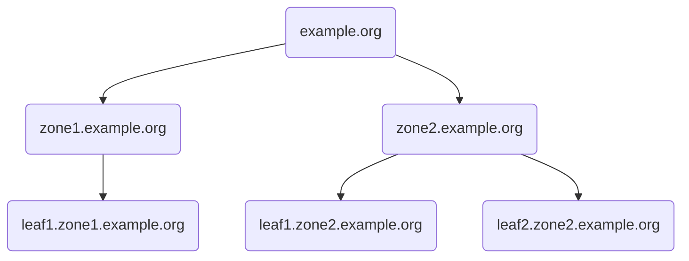

# mkpki

A tool to generate a three-tier PKI with zones separated by [Name Constraints](https://www.rfc-editor.org/rfc/rfc5280#section-4.2.1.10).

This architecture allows efficient zone revocation and reduces the severity of a key compromise:
If an intermediate key is compromised, the damage is limited to a specific zone.
If the root key is compromised, the damage is limited to a specific domain.

## Overview

* The root CA is constraint to a specific domain, e.g., `example.org`, meaning that all certificates issued by the root CA are only ever valid for subdomains of `example.org`.
* The intermediate CA is constraint to an even more specific domain, e.g., `zone1.example.org`, meaning that all certificates issued by the intermediate CA are only ever valid for subdomains of `zone1.example.org`.
* The leaf certificates are typical X.509 leaf certificates and cannot be used for further issuance.
